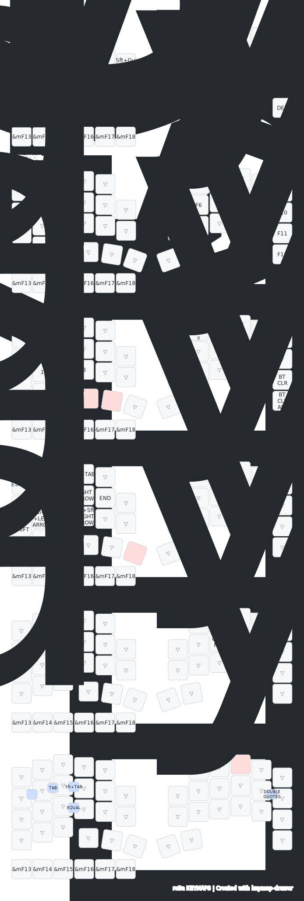

# roBa Keyboard with Farcaress

This is a custom keyboard configuration with Farcaress touch sensor integration.

## Features

- 3-point capacitive touch sensor (Farcaress)
- Gesture control support
- Enhanced input capabilities

### Keymap


## Building with zmk-nix

### Prerequisites
- Nix package manager with flakes enabled

### Setup
1. Initialize zmk-nix:
```bash
nix flake init --template github:lilyinstarlight/zmk-nix
```

2. Modify the `flake.nix` configuration:
```nix
firmware = zmk-nix.legacyPackages.${system}.buildSplitKeyboard {
  // ...other configurations...
  board = "seeeduino_xiao_ble";
  shield = "roBa_%PART%";
  parts = [ "L" "R" ];
  snippets = [ "zmk-usb-logging" ];
  enableZmkStudio = true;
  // ...other configurations...
};
```

3. The template will create necessary files including:
- `.github/` workflows
- `flake.nix` configuration
- `.gitignore`

### Building
To build the firmware:
```bash
nix build
```

The firmware files will be available in the `result/` directory.

### Flashing
To flash the firmware:
```bash
nix run .#flash
```

### Updating Dependencies
To update ZMK and other dependencies:
```bash
nix run .#update
```

### Troubleshooting

#### Hash Mismatch Error
If you encounter a hash mismatch error like this:
```
error: hash mismatch in fixed-output derivation:
         specified: sha256-reAWLQgGuZQiCiN5yGoVlbN6CT5yxl7lEk2/HbvL2x4=
            got:    sha256-YkNPlLZcCguSYdNGWzFNfZbJgmZUhvpB7DRnj++XKqQ=
```

Update the `zephyrDepsHash` in your `flake.nix` with the "got" hash value:
```nix
firmware = zmk-nix.legacyPackages.${system}.buildSplitKeyboard {
  // ...existing configurations...
  zephyrDepsHash = "sha256-YkNPlLZcCguSYdNGWzFNfZbJgmZUhvpB7DRnj++XKqQ=";
  // ...existing configurations...
};
```